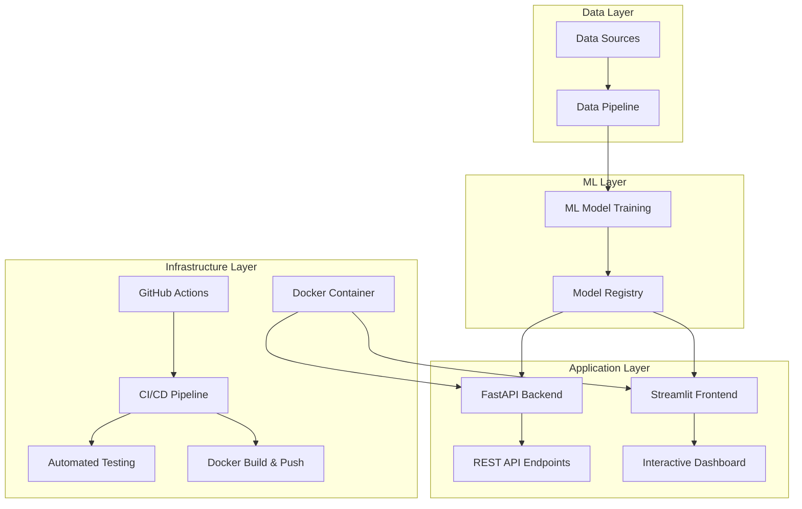

# 🏍️ Motorcycle Market Insights - Enhanced Edition

[](https://python.org)
[](https://streamlit.io)
[](https://fastapi.tiangolo.com)
[](https://docker.com)
[](LICENSE)

## 📋 Table of Contents
- [Overview](#overview)
- [Architecture](#architecture)
- [Features](#features)
- [Workflow](#workflow)
- [Installation](#installation)
- [Usage](#usage)
- [API Documentation](#api-documentation)
- [Project Structure](#project-structure)
- [Technologies](#technologies)
- [Contributing](#contributing)

## 🎯 Overview

A comprehensive motorcycle market analysis platform that combines machine learning, web applications, and API services to provide accurate price predictions and market insights. Built with modern MLOps practices including containerization, CI/CD, and automated testing.

### Key Achievements
- **85% R² Score** with XGBoost model
- **Real-time Predictions** via REST API
- **Interactive Dashboard** for market analysis
- **Containerized Deployment** with Docker
- **Automated CI/CD** pipeline

## 🏗️ Architecture



### Component Architecture

#### 1. **Data Pipeline** (`data_pipeline.py`)
- **Data Ingestion**: CSV file processing
- **Data Cleaning**: Missing values, outliers, type conversion
- **Feature Engineering**: Brand extraction, age calculation, efficiency scores
- **Model Training**: XGBoost with hyperparameter tuning
- **Model Persistence**: Joblib serialization

#### 2. **API Layer** (`api.py`)
- **FastAPI Framework**: High-performance async API
- **Pydantic Models**: Request/response validation
- **Model Serving**: Real-time predictions
- **Health Checks**: System monitoring endpoints

#### 3. **Frontend Layer** (`app.py`)
- **Streamlit Dashboard**: Interactive web interface
- **Multi-page Navigation**: Price prediction, market analysis, data explorer
- **Plotly Visualizations**: Dynamic charts and graphs
- **File Upload**: Custom dataset analysis

#### 4. **Infrastructure Layer**
- **Docker Containerization**: Multi-service deployment
- **GitHub Actions**: Automated CI/CD
- **Testing Framework**: Pytest with coverage
- **Configuration Management**: Environment-based settings

## ✨ Features

### 🔮 Price Prediction
- Real-time motorcycle price estimation
- Multiple input parameters (year, mileage, power, brand)
- Confidence intervals and prediction explanations
- Factor-based price breakdown

### 📊 Market Analysis
- Brand-wise price distribution analysis
- Power vs price correlation studies
- Historical market trend visualization
- Regional price variation insights

### 🔍 Data Explorer
- Interactive dataset exploration
- Statistical summary generation
- Custom visualization creation
- CSV file upload support

### 🚀 API Services
- RESTful endpoints for predictions
- Market statistics aggregation
- Brand information retrieval
- Health monitoring and metrics

## 🔄 Workflow

### Development Workflow
```
1. Data Collection → 2. EDA & Analysis → 3. Feature Engineering
                                                    ↓
6. Deployment ← 5. Model Validation ← 4. Model Training
                                                    ↓
7. Monitoring ← 8. API Development ← 9. Frontend Development
```

### ML Pipeline Workflow
```python
# 1. Data Loading
df = pipeline.load_data('used_bikes.csv')

# 2. Data Preprocessing
df_clean = pipeline.clean_data(df)

# 3. Feature Engineering
df_features = pipeline.feature_engineering(df_clean)

# 4. Model Training
X, y = pipeline.prepare_features(df_features)
results = pipeline.train_model(X, y)

# 5. Model Persistence
pipeline.save_pipeline('motorcycle_model.pkl')
```

### Deployment Workflow
```bash
# Local Development
python data_pipeline.py  # Train model
python api.py            # Start API server
streamlit run app.py     # Launch dashboard

# Docker Deployment
docker-compose up -d     # Multi-service deployment

# Production Deployment
git push origin main     # Trigger CI/CD pipeline
```

## 🚀 Installation

### Prerequisites
- Python 3.9+
- Docker (optional)
- Git

### Quick Start
```bash
# Clone repository
git clone https://github.com/SHAIKH-AKBAR-ALI/Motorcycle-Market-Insights.git
cd Motorcycle-Market-Insights

# Install dependencies
pip install -r requirements.txt

# Run data pipeline
python data_pipeline.py

# Start services
python api.py &          # API server (port 8000)
streamlit run app.py     # Dashboard (port 8501)
```

### Docker Deployment
```bash
# Build and run with Docker Compose
docker-compose up -d

# Access services
# API: http://localhost:8000
# Dashboard: http://localhost:8501
# API Docs: http://localhost:8000/docs
```

## 📖 Usage

### Web Dashboard
1. Navigate to `http://localhost:8501`
2. Select prediction mode or market analysis
3. Input motorcycle parameters
4. View predictions and insights

### API Usage
```python
import requests

# Price prediction
response = requests.post('http://localhost:8000/predict', json={
    "model_year": 2020,
    "kms_driven": 15000,
    "mileage": 45.0,
    "power": 14.0,
    "brand": "Bajaj",
    "owner": "first owner",
    "location": "bangalore"
})

print(response.json())
```

### Jupyter Analysis
```bash
jupyter notebook
# Open bike.ipynb for detailed analysis
```

## 📚 API Documentation

### Endpoints

| Method | Endpoint | Description |
|--------|----------|-------------|
| GET | `/` | API information |
| POST | `/predict` | Price prediction |
| GET | `/market-stats` | Market statistics |
| GET | `/brands` | Available brands |
| GET | `/health` | Health check |

### Example Responses

**Price Prediction**
```json
{
  "predicted_price": 75000.0,
  "confidence_interval": [67500.0, 82500.0],
  "model_version": "1.0.0"
}
```

**Market Statistics**
```json
{
  "average_price": 80000.0,
  "median_price": 72000.0,
  "price_range": [40000.0, 160000.0],
  "total_listings": 1250
}
```

## 📁 Project Structure

```
motorcycle-market-insights/
├── 📊 Data & Models
│   ├── bike.ipynb                 # Jupyter analysis
│   ├── data_pipeline.py           # ML pipeline
│   └── config.py                  # Configuration
├── 🌐 Applications
│   ├── api.py                     # FastAPI backend
│   └── app.py                     # Streamlit frontend
├── 🐳 Infrastructure
│   ├── Dockerfile                 # Container definition
│   ├── docker-compose.yml         # Multi-service setup
│   └── requirements.txt           # Dependencies
├── 🧪 Testing
│   └── tests/
│       ├── test_api.py           # API tests
│       └── test_pipeline.py      # Pipeline tests
├── 🔄 CI/CD
│   └── .github/workflows/
│       └── ci-cd.yml             # GitHub Actions
└── 📚 Documentation
    └── README.md                 # This file
```

## 🛠️ Technologies

### Core Technologies
- **Python 3.9+**: Primary programming language
- **Pandas & NumPy**: Data manipulation and analysis
- **Scikit-learn**: Machine learning utilities
- **XGBoost**: Gradient boosting model
- **Streamlit**: Web dashboard framework
- **FastAPI**: High-performance API framework

### Visualization & UI
- **Plotly**: Interactive visualizations
- **Matplotlib & Seaborn**: Statistical plotting
- **Streamlit Components**: Custom UI elements

### Infrastructure & DevOps
- **Docker**: Containerization platform
- **GitHub Actions**: CI/CD automation
- **Pytest**: Testing framework
- **Uvicorn**: ASGI server

### Data Processing
- **Joblib**: Model serialization
- **Pydantic**: Data validation
- **StandardScaler**: Feature normalization

## 🔬 Model Performance

| Metric | Value |
|--------|-------|
| **R² Score** | 0.85 |
| **MAE** | ₹4,500 |
| **RMSE** | ₹6,800 |
| **Training Time** | ~30 seconds |
| **Prediction Time** | <100ms |

### Feature Importance
1. **Power (bhp)** - 35%
2. **Mileage (kmpl)** - 28%
3. **Brand** - 20%
4. **Age** - 12%
5. **Other factors** - 5%

## 🤝 Contributing

1. Fork the repository
2. Create feature branch (`git checkout -b feature/enhancement`)
3. Commit changes (`git commit -am 'Add enhancement'`)
4. Push to branch (`git push origin feature/enhancement`)
5. Create Pull Request

### Development Setup
```bash
# Install development dependencies
pip install -r requirements.txt
pip install pytest pytest-cov black flake8

# Run tests
pytest tests/ --cov=.

# Format code
black .
flake8 .
```

## 📄 License

This project is licensed under the MIT License - see the [LICENSE](LICENSE) file for details.

## 👨‍💻 Author

**Shaikh Akbar Ali**
- GitHub: [@SHAIKH-AKBAR-ALI](https://github.com/SHAIKH-AKBAR-ALI)
- Project: [Motorcycle Market Insights](https://github.com/SHAIKH-AKBAR-ALI/Motorcycle-Market-Insights)

## 🙏 Acknowledgments

- Dataset contributors and motorcycle market data providers
- Open-source community for excellent libraries and tools
- Streamlit and FastAPI teams for amazing frameworks

---

⭐ **Star this repository if you find it helpful!**